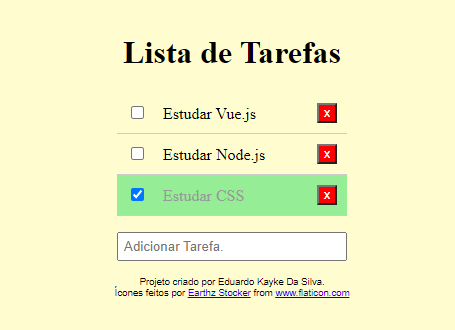

# Lista de Tarefas

## Sobre o projeto.
Lista de tarefas criada para facilitar a rotina diária. Podendo adicionar e remover suas atividades ao longo do dia. Utilizei o Bootstrap para o estilo da página. As informações são salvas no banco de dados interno do navegador.

Data de conclusão: 17/11/2021

## Ferramentas e tecnologias usadas nesse projeto.
 
```js    
function ListaDeTarefas(Project) {
    if (Front End) {
        const Stack = `${HTML}, ${CSS}, ${JavaScript}`;
    } else (Framework) {
        const Stack = `${Bootstrap}`;
    }
};

```
<br>

<div align="center">



---

> - Autores: 
>   - [Eduardo Kayke](https://github.com/EduardoKayke "Perfil do Eduardo")

- [Voltar ao perfil do Github.](https://github.com/EduardoKayke "Perfil do Eduardo")

_Um dia seremos a tecnologia. Biohacking a própria evolução de nós mesmos._
